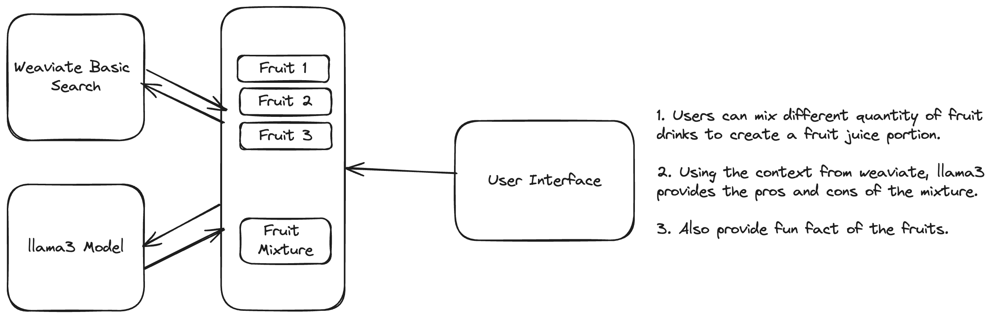

# Fruit Mixer



## Overview

Fruit Mixer is a user-friendly application that allows users to input various fruits and returns detailed information about those fruits. This project leverages modern tools and technologies to provide an intuitive and informative experience.

## Tools and Technologies Used

- **Weaviate**: Utilized for embedding and handling basic searches.
- **Llama3**: Employed for Retrieval Augmented Generation to enhance the quality of information retrieval.
- **Lightning AI**: Hosts the backend and exposes the functionalities via an API.

## How It Works

1. Users input the names of fruits they want to learn about.
2. The application processes the input and searches for relevant information.
3. The information is retrieved and presented to the user in a comprehensible format.

## Limitations

1. **Information Coverage**: More detailed information about fruits is not embedded in this version.
2. **Query Depth**: Currently, deeper queries cannot be carried out.
3. **Performance**: The fetch request may be a bit slow.
4. **Animation**: The mixture process is not animated.

## Getting Started

### Prerequisites

- Python 3.x
- Weaviate
- Llama3
- Lightning AI

### Installation

1. Clone the repository:
   ```bash
   git clone https://github.com/yourusername/fruit-mixer.git
